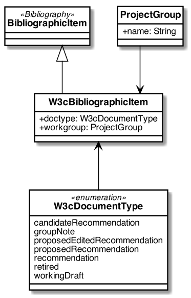

= The Relaton W3cBibliographic Model

This bibliographic model is developed to consolidate and standardize
the data model used for bibliographic and citation purposes.

This model is meant to be fully compatible with ISO 690 and
ISO TC 46's (and SC 4, SC 9) work on bibliography.

It is used extensively in the following projects as containers
for bibliographic data management and for managing document metadata:

* TODO

Below are the UML diagram.

The document model are expressed as UML and as RelaxNG Compact (RNC) grammar;
see discussion under
https://github.com/metanorma/metanorma-model-iso/tree/master/grammars[Grammars]. This
repository contains the RNC grammars for the W3cBibliographicItem model.

The document model are currently used by IsoDoc-based authoring tools for
standards, which convert Asciidoctor source to XML representations of the
document model, and validate the XML generated against the RNC schemas:

* TODO

It is also used by tools that render those XML representations of the document model, into HTML and Microsoft Word:

* TODO

== W3cBibliography UML Models

== Example

[source,xml]
----
<bibdata type="standard">
  <title language="en" format="plain" type="main">JSON-LD 1.1</title>
  <uri type="src">https://www.w3.org/TR/2020/CR-json-ld11-20200305/</uri>
  <docidentifier>JSON-LD 1.1</docidentifier>
  <date type='published'><on>2020-03-05</on></date>
  <contributor>
    <role type="editor"/>
    <person>
      <name>
        <completename>Gregg Kellogg</completename>
      </name>
    </person>
  </contributor>
  <contributor>
    <role type="editor"/>
    <person>
      <name>
        <completename>Pierre-Antoine Champin</completename>
      </name>
    </person>
  </contributor>
  <contributor>
    <role type="editor"/>
    <person>
      <name>
        <completename>Dave Longley</completename>
      </name>
    </person>
  </contributor>
  <language>en</language>
  
  <copyright>
    <from>2020</from>
    <owner>
      <organization>
        <name>W3C</name>
      </organization>
    </owner>
  </copyright>
  <keyword>Data</keyword>
  <ext>
    <doctype>candidateRecommendation</doctype>
    <editorialgroup>
      <technical-committee>JSON-LD Working Group</technical-committee>
    </editorialgroup>
  </ext>
</bibdata>
----